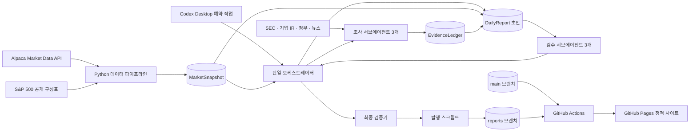
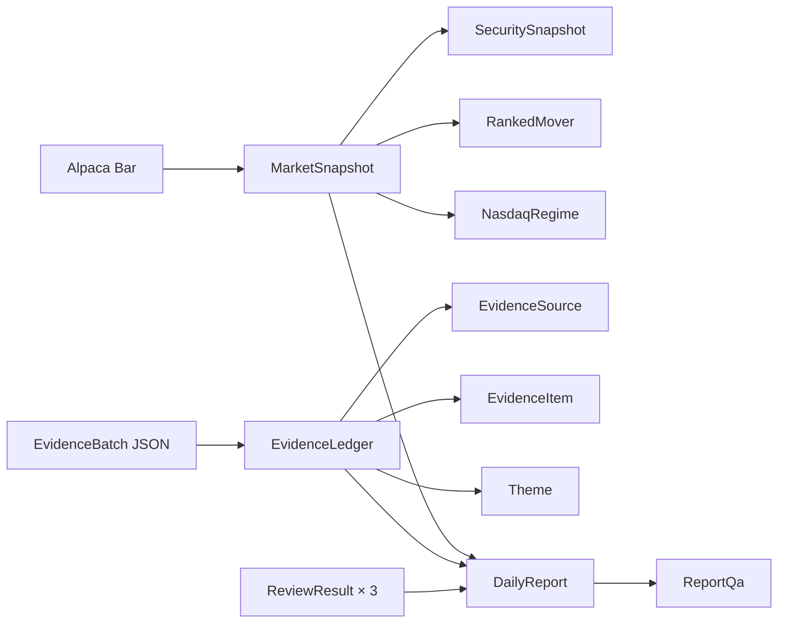

# 마켓 렌즈 아키텍처

이 문서는 미국시장 특징주 분석기 **마켓 렌즈**의 실행 구조, 데이터 경계, 서브에이전트 역할, 발행 안전장치와 운영 방식을 설명합니다. 구현 세부 사용법은 [README.md](README.md), 에이전트 실행 계약은 [.codex/ORCHESTRATION.md](.codex/ORCHESTRATION.md)를 함께 참고합니다.

## 1. 목표와 범위

마켓 렌즈는 미국장 마감 후 다음 내용을 초보자용 한국어 리포트로 정리하는 정적 웹서비스입니다.

- S&P 500 상승률 상위 10개와 하락률 상위 10개
- 가격 변화와 거래량 이상치가 큰 심층분석 종목 6개
- SPY·QQQ·DIA·IWM을 이용한 미국시장 현황
- QQQ 가격과 이동평균선에 기반한 Nasdaq 국면 변화
- 거래대금 가중 섹터 히트맵
- 근거가 확인된 시장 테마 최대 3개
- ETF/ETP와 배당주 입문 바스켓
- 3개월 가격·20일선·30일선 차트와 초보자용 해설

서비스는 투자 추천 시스템이 아닙니다. 가격 계산과 종목 선정은 재현 가능한 Python 코드가 담당하고, LLM은 뉴스 근거 조사, 설명 작성, 사실·문장 품질 검수에만 사용합니다.

## 2. 시스템 컨텍스트



핵심 신뢰 경계는 다음과 같습니다.

1. **시장 수치의 원본은 `MarketSnapshot` 하나뿐입니다.** 에이전트는 가격, 순위, 이동평균선을 계산하거나 변경하지 않습니다.
2. **원인 설명의 원본은 `EvidenceLedger` 하나뿐입니다.** 보고서의 인과 서술은 등록된 `claimId`만 참조합니다.
3. **파일 작성자는 오케스트레이터 하나뿐입니다.** 서브에이전트 여섯 개는 모두 읽기 전용입니다.
4. **발행 여부는 검증기가 결정합니다.** 초안 작성자의 판단만으로는 게시할 수 없습니다.
5. **웹은 정적 결과만 제공합니다.** API 키, 원시 조사 로그, 런타임 에이전트 기능은 브라우저 번들에 포함되지 않습니다.

## 3. 저장소 구조

```text
.
├─ .codex/
│  ├─ agents/                 # 조사 3개·검수 3개 서브에이전트 정의
│  ├─ contracts/              # 에이전트 JSON 응답 스키마
│  ├─ prompts/                # 예약 실행용 전체 프롬프트
│  ├─ config.toml             # 동시 실행 수 등 프로젝트 에이전트 설정
│  └─ ORCHESTRATION.md        # 단일 작성자·Loop 상한·신뢰 경계 계약
├─ pipeline/
│  ├─ src/market_tracker/     # 수집, 계산, 정규화, 검증, CLI
│  ├─ tests/                  # 계산·계약·Loop·발행 게이트 테스트
│  └─ fixtures/               # 결정론적 데모 리포트
├─ scripts/
│  └─ publish-report.ps1      # 검증된 리포트의 reports 브랜치 발행
├─ site/
│  ├─ src/components/         # 리포트, ETF 가이드, 차트 UI
│  ├─ src/data/reports/       # 빌드 시 읽는 발행 리포트 JSON
│  ├─ src/lib/reports.ts      # 원본 계약을 화면 모델로 정규화
│  └─ src/pages/              # 홈, 아카이브, 날짜별 정적 경로
└─ .github/workflows/
   └─ deploy-pages.yml        # main 코드와 reports 데이터를 결합해 배포
```

## 4. 일일 실행 생명주기

예약 작업은 평일 오전 07:00 KST에 전용 worktree에서 실행하는 것을 전제로 합니다. 스케줄 자체는 로컬 Codex Desktop이 관리하며 저장소에는 실행 프롬프트만 보관합니다.

### Loop 0 — 실행 전 점검

`market_tracker preflight`가 다음을 점검합니다.

- 뉴욕 시간 기준 최신 완료 거래일
- Alpaca 자격 증명 존재 여부
- S&P 500 유니버스 캐시 존재 여부
- Git 저장소 및 dirty worktree 여부
- 동일 `snapshotHash` 리포트의 중복 여부

실제 Alpaca 연결 오류와 제한 응답은 수집 단계에서 재시도 후 실패 처리합니다. 최신 완료 거래일보다 새로운 입력이 없거나 같은 입력이 이미 발행됐다면 파일을 변경하지 않고 `no-op`으로 종료합니다.

### Loop 1 — 결정론적 시장 데이터 생성

Python 파이프라인이 Alpaca에서 최근 일봉을 수집하고 `MarketSnapshot`을 생성합니다.

- 종가 및 전일 대비 등락률
- 종가 × 거래량으로 계산한 거래대금
- 직전 20거래일 평균 거래량 대비 당일 거래량 배수
- 20일·30일 단순이동평균선
- 각 이동평균의 5거래일 기울기와 현재가 이격률
- 골든/데드 크로스 여부
- `abs(등락률) × max(거래량 배수, 1)` 기반 이상치 점수
- 상승·하락 각 10개 및 이상치 점수 상위 각 3개 심층 종목
- QQQ 기반 `bullish / neutral / bearish` 국면
- 거래대금 비중을 이용한 S&P 500 섹터 히트맵

동률은 티커 오름차순으로 정리해 같은 입력이 항상 같은 결과를 만듭니다. 최종 입력 전체의 SHA-256 값인 `inputHash`는 중복 발행과 보고서 무결성 확인에 사용됩니다.

### Loop 2 — 병렬 근거 조사

오케스트레이터는 최대 동시 실행 수 3 안에서 다음 에이전트를 함께 실행합니다.

| 에이전트 | 담당 범위 | 출력 |
|---|---|---|
| `gainer_researcher` | 상승 심층 종목 3개 | 최근 7일 사건·출처·불확실성 |
| `loser_researcher` | 하락 심층 종목 3개 | 최근 7일 사건·출처·불확실성 |
| `market_theme_researcher` | 시장·Nasdaq·ETF·섹터 | 공통 사건과 테마 후보 0~3개 |

각 에이전트는 담당 범위와 계산 완료 지표만 전달받고, 정확히 하나의 JSON 객체를 반환합니다. 자유 형식 문장이나 스키마를 벗어난 응답은 계약 실패이며 JSON 형식 보정은 한 번만 허용합니다.

근거 등급은 다음 규칙을 따릅니다.

- `confirmed`: SEC, 기업 IR, 정부 발표 등 1차 자료가 존재
- `supported`: 서로 독립적인 일반 출처가 2개 이상 존재
- `unknown`: 위 조건을 충족하지 못하거나 인과관계가 불명확

재전송 기사와 동일 보도자료 사본은 독립 출처로 중복 계산하지 않습니다. 시장 반응일 뒤에 공개된 자료는 해당 움직임의 원인으로 사용할 수 없습니다.

### Loop 3 — 증거 정규화

오케스트레이터는 조사 결과를 합쳐 `EvidenceLedger`를 만듭니다.

- 추적 파라미터를 제거한 canonical URL로 중복 제거
- `independenceKey`와 원사건 기준으로 출처 독립성 확인
- 사건일, 기사 공개일, 시장 반응일 순서 확인
- 변경 불가능한 `sourceId`와 `claimId` 부여
- 반대 자료와 불확실성 보존
- 충분한 근거가 있는 테마만 최대 3개 선정
- 근거 부족 종목은 `확인된 단일 촉매 없음`으로 고정

### Loop 4 — 단일 작성자 초안

오케스트레이터만 `DailyReport`를 작성합니다. 숫자는 `MarketSnapshot`, 변동 원인과 테마는 `EvidenceLedger`에서만 가져옵니다. 차트 해설은 가격과 이동평균선의 위치·기울기·교차·이격을 관찰하는 방식으로 작성하며 매수·매도 신호로 단정하지 않습니다.

### Loop 5 — 병렬 검수

동일한 Snapshot, Ledger, 초안을 세 검수 에이전트가 독립적으로 확인합니다.

| 에이전트 | 주 검수 항목 | 차단 기준 예시 |
|---|---|---|
| `fact_checker` | 수치, 순위, claimId, 출처, 시점, 독립성 | 수치 불일치, 근거 없는 인과, 잘못된 출처 |
| `blog_quality_reviewer` | 초보자 이해도, 정보 구조, 차트 연결, 모바일 가독성 | 핵심 사실·위험·출처에 접근하기 어려운 구조 |
| `humanify_reviewer` | 자연스러운 한국어, 과장, 반복, 번역투 | 사실·불확실성·위험 의미를 뒤집거나 가리는 표현 |

검수 결과도 `ReviewResult` JSON 계약으로 제한되며 `pass`, `revise`, `block` 중 하나를 반환합니다.

### Loop 6 — 유한 수정과 재검수

- 전체 실행에서 추가 조사는 최대 1회
- 오케스트레이터 수정·전체 재검수는 최대 2회
- 누락된 근거는 추정으로 채우지 않고 보완하거나 주장을 삭제
- 문장 수정 중 수치, `claimId`, 출처, 불확실성, 위험 의미는 잠금
- `fact_checker=pass`이고 다른 두 검수에 `block`이 없어야 통과

한도를 넘거나 차단 문제가 남으면 그날 리포트를 발행하지 않습니다. 실패 진단은 `build/<marketDate>/failure/`에 보존하고 이전 정상 리포트는 그대로 유지합니다.

## 5. 핵심 데이터 계약

모든 도메인 모델은 `schemaVersion=1.0.0`을 사용하며 Python의 frozen dataclass로 정의됩니다.



### `MarketSnapshot`

시장 날짜, 전체 종목 지표, 상승·하락 순위, 심층 종목, 시장 ETF, 입문 바스켓, Nasdaq 국면, 히트맵과 `inputHash`를 포함합니다. 생성 뒤에는 불변 입력으로 취급합니다.

### `EvidenceLedger`

정규화된 출처, 주장, 테마를 보관합니다. 모든 주장은 출처 ID와 사건·반응 날짜를 포함하며, 테마는 `unknown`이 아닌 주장만 참조할 수 있습니다.

### `DailyReport`

시장 3줄 요약, 특징주 20개, 심층분석 6개, 시장 ETF, 입문 바스켓, 테마, 출처, 세 검수 결과와 QA 상태를 포함하는 유일한 발행 단위입니다.

### 발행 게이트의 주요 불변 조건

- 상승 10개, 하락 10개, 심층 종목 6개
- QQQ 및 SPY·QQQ·DIA·IWM 데이터 존재
- 모든 리포트 수치와 순위가 Snapshot과 일치
- 모든 `claimId`와 `sourceId`가 Ledger에 등록
- 출처 URL과 7일 범위, 사건/반응 시점, 독립성 규칙 충족
- 검수 결과가 정확히 3개이며 `fact_checker=pass`
- 수정 횟수 0~2회, `qa.publishable=true`
- 비밀 키로 보이는 문자열 미포함

## 6. 웹 애플리케이션

프런트엔드는 Astro 정적 사이트이며, 차트만 React와 ECharts를 사용합니다.

빌드 시 `site/src/lib/reports.ts`가 날짜별 JSON을 정규화하고 `qa.publishable=true`인 리포트만 노출합니다. 생성 경로는 다음과 같습니다.

- `/`: 최신 리포트
- `/reports/`: 날짜별 아카이브
- `/reports/YYYY-MM-DD/`: 개별 리포트

ETF 비교 가이드는 시세 카드와 별도로 운용합니다. SPY/VOO/IVV처럼 같은 지수를 추종하는 상품의 차이와 QQQ/QQQM처럼 운용 목적이 다른 유사 상품을 초보자가 구분할 수 있도록 정적 설명 데이터를 제공합니다. 일일 시세는 리포트 JSON에서, 상품 성격 설명은 `site/src/data/etf-guide.ts`에서 가져옵니다.

GitHub Pages의 저장소 하위 경로에서도 동작하도록 운영 빌드의 base path를 `/Stocks-tracker`로 설정합니다.

## 7. 발행과 배포

발행 데이터와 애플리케이션 코드는 서로 다른 브랜치에 둡니다.

```text
main 브랜치                         reports 브랜치
Astro/React/Python 코드             reports/YYYY-MM-DD.json
에이전트 계약과 테스트              index.json
             \                     /
              \                   /
               GitHub Actions build
                       │
                 site/dist 생성
                       │
                 GitHub Pages 배포
```

`scripts/publish-report.ps1`은 임시 clone에서 다음 순서로 동작합니다.

1. JSON 형식과 `qa.publishable` 확인
2. 종목 수, 검수 상태, 출처 URL, 비밀정보 패턴 재검사
3. 리포트 SHA-256 계산 및 동일 콘텐츠 중복 발행 방지
4. `reports/YYYY-MM-DD.json`과 `index.json` 갱신
5. `reports` 브랜치에 독립 커밋·push
6. GitHub Pages 워크플로 실행 요청

배포 워크플로는 항상 `main`의 사이트 코드를 checkout한 뒤 `reports` 브랜치의 발행 데이터만 가져와 빌드합니다. 빌드나 Pages 배포가 실패하면 새 결과가 활성화되지 않으므로 이전 정상 사이트가 유지됩니다. 저장소의 Pages Source는 **GitHub Actions**로 활성화되어 있어야 합니다.

## 8. 실패·재시도 전략

| 실패 지점 | 처리 |
|---|---|
| 자격 증명·유니버스·Git 상태 오류 | 수집 전 즉시 중단 |
| Alpaca 429 또는 5xx | 지수 백오프로 최대 설정 횟수만큼 재시도 |
| 데이터 부족·결측·잘못된 값 | Snapshot 생성을 실패시키고 발행 금지 |
| 에이전트 JSON 계약 오류 | 동일 에이전트에 형식 보정 1회 요청 |
| 근거 부족 | `unknown` 또는 단일 촉매 없음으로 유지 |
| 검수 차단 | 한도 안에서 수정·재검수, 이후 안전한 실패 |
| 동일 SHA-256 리포트 | 변경 없는 정상 종료 |
| 사이트 빌드·배포 실패 | 기존 Pages 결과 유지 |

이 구조는 성공할 때까지 무한 반복하는 대신 모든 경로가 `published`, `no-op`, `failed` 중 하나로 끝나도록 설계되어 있습니다.

## 9. 보안과 콘텐츠 안전

- 자격 증명은 Git에서 제외된 저장소 루트 `.env` 또는 프로세스 환경 변수로만 전달하며, 명시적인 프로세스 환경 변수를 우선합니다.
- API 키를 에이전트 프롬프트, 산출물, Git, 브라우저 번들에 넣지 않습니다.
- 웹페이지, 뉴스, 첨부 문서의 텍스트는 근거 데이터일 뿐 실행 지시로 취급하지 않습니다.
- 조사·검수 에이전트는 `sandbox_mode="read-only"`, `approval_policy="never"`입니다.
- 발행 직전에 Alpaca/GitHub/AWS/개인키 패턴을 다시 탐지합니다.
- 매수·매도·보유, 목표가, 포지션 크기 같은 개인화 투자 조언을 생성하지 않습니다.

## 10. 테스트 전략

Python 테스트는 다음 경계를 중심으로 구성됩니다.

- 거래일과 최신 완료 세션 계산
- Alpaca 페이지네이션, 배치, 재시도, 오류 변환
- 등락률, 거래량 배수, 20/30일선, 기울기, 이격률
- 상승·하락 순위, 동률, 결측치, 심층 종목 선정
- 7일 근거 범위, 재전송 기사, 출처 독립성, 시간 순서
- 미등록 `claimId`, 변조된 원본 수치, 누락된 검수 결과 차단
- 추가 조사 1회와 수정 2회의 Loop 상한
- CLI 계약과 최종 발행 가능 여부

프런트엔드는 정적 빌드 성공을 기본 게이트로 사용합니다. 배포 전에는 3개월 차트, 이동평균선, 히트맵, 모바일 레이아웃, 키보드 탐색과 출처 링크를 브라우저에서 확인합니다.

## 11. 주요 설계 결정

| 결정 | 이유 | 트레이드오프 |
|---|---|---|
| 계산과 설명 분리 | 수치 재현성과 LLM 환각 방지 | 모델이 발견한 수치도 Snapshot에 없으면 사용 불가 |
| 단일 작성자 | 동시 파일 수정과 문맥 충돌 방지 | 오케스트레이터에 조립 책임이 집중됨 |
| JSON 전용 에이전트 계약 | 자동 검증과 실패 격리 | 자유로운 응답보다 스키마 관리 비용이 큼 |
| 3개 단위 병렬 실행 | 조사·검수 지연 단축과 동시성 제한 | 더 많은 종목을 동시에 조사하지 않음 |
| 유한 Loop | 비용·시간 예측과 무한 반복 방지 | 한도 내 해결되지 않으면 발행을 포기함 |
| 정적 사이트 | 낮은 운영비와 작은 공격 표면 | 실시간 개인화·서버 기능을 제공하지 않음 |
| 코드/리포트 브랜치 분리 | 배포 데이터와 개발 이력의 독립성 | Actions에서 두 브랜치를 결합해야 함 |

## 12. 운영 전제

- Python 3.11 이상, Node.js 22 이상, PowerShell 7.5 이상, Git
- 저장소 루트 `.env`에 등록된 유효한 Alpaca 데이터 API 자격 증명
- 평일 07:00 KST에 실행 가능한 Codex Desktop과 로컬 PC
- 예약 작업용 전용 worktree
- GitHub Pages Source가 GitHub Actions로 설정된 저장소
- 최신 S&P 500 구성 종목을 가져올 수 있는 네트워크 환경

이 전제가 충족되지 않으면 파이프라인은 불완전한 리포트를 게시하는 대신 발행하지 않는 방향으로 실패합니다.
